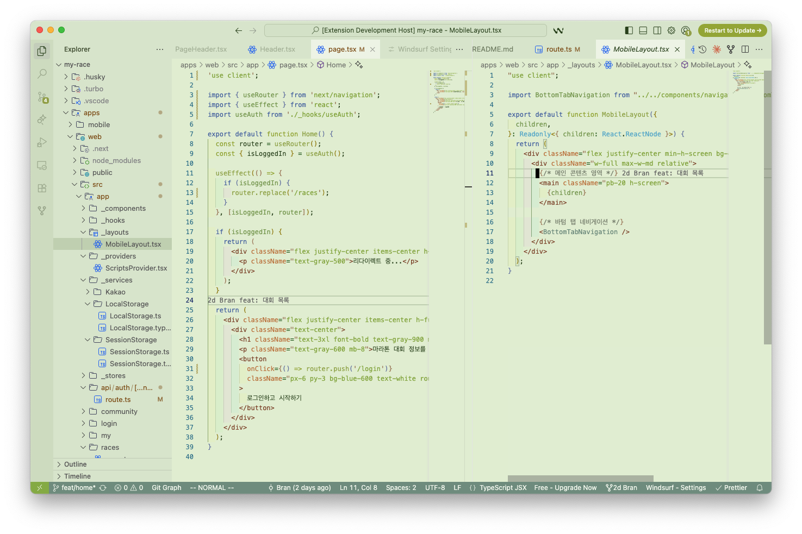
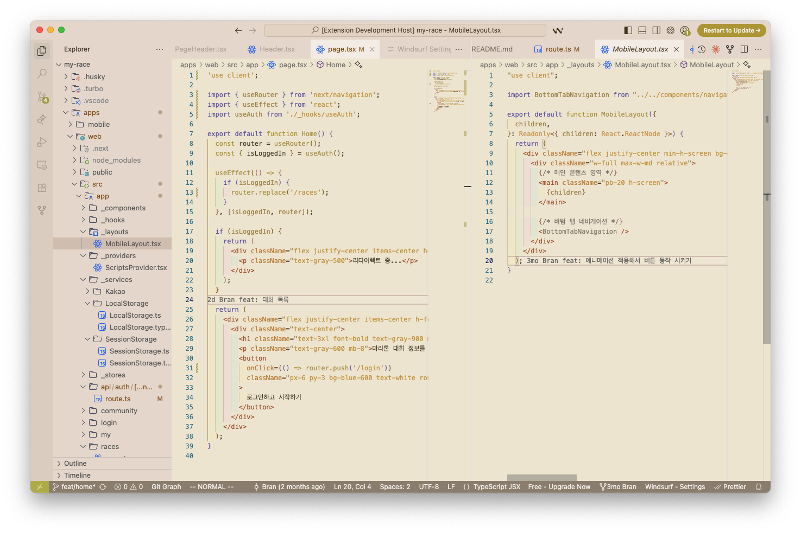
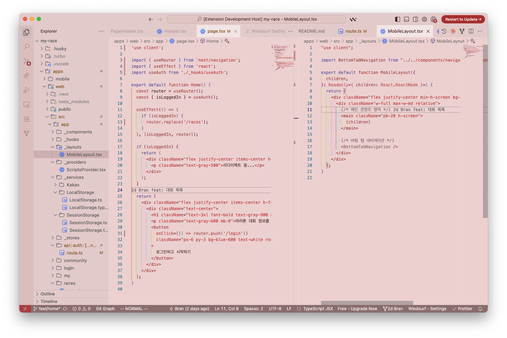

# Eyes on Lichen

A soothing collection of light themes inspired by the natural colors of lichen, designed to be easy on the eyes during long coding sessions.

## 🎨 Theme Variants

### 🌲 Forest
A gentle green-based theme that captures the essence of forest lichen with soft, natural tones.

### 🏛️ Wall
A warm yellow-based theme reminiscent of lichen growing on ancient stone walls.

### 🦀 Rust
A muted red-based theme inspired by the earthy, rust-colored lichen found in nature.

## 🌟 Features

- **Eye-friendly colors**: Carefully selected pastel tones that reduce eye strain
- **Consistent design**: All three themes maintain visual harmony while offering distinct color palettes
- **Light theme optimized**: Perfect for well-lit environments and daytime coding
- **Natural inspiration**: Colors derived from real lichen specimens for authentic, organic feel

## 📦 Installation

1. Open Visual Studio Code
2. Go to Extensions (Ctrl+Shift+X / Cmd+Shift+X)
3. Search for "Eyes on Lichen"
4. Click Install
5. Open Command Palette (Ctrl+Shift+P / Cmd+Shift+P)
6. Type "Preferences: Color Theme"
7. Select your preferred variant:
   - Eyes on Lichen - Forest
   - Eyes on Lichen - Wall
   - Eyes on Lichen - Rust

## 🖼️ Screenshots

### 🌲 Forest Theme

### 🏛️ Wall Theme

### 🦀 Rust Theme

## 🎯 Design Philosophy

Eyes on Lichen themes are built around the principle of **visual comfort**. Each color has been carefully chosen to:

- Maintain excellent readability across different code elements
- Reduce eye fatigue during extended coding sessions
- Provide subtle visual hierarchy without being distracting
- Create a calming, natural atmosphere in your development environment

The themes preserve consistent relationships between colors when shifting from green (Forest) to yellow (Wall) to red (Rust), ensuring a familiar experience regardless of your chosen variant.

## 🔧 Supported Languages

These themes work with all programming languages supported by VS Code, with optimized syntax highlighting for:

- JavaScript/TypeScript
- Python
- CSS/SCSS
- HTML
- Markdown
- JSON
- And many more...

## 🐛 Issues & Feedback

Found a bug or have a suggestion? Please open an issue on our [GitHub repository](https://github.com/june20516/eyes-on-lichen).

## 📄 License

This theme is licensed under the MIT License.

## 🙏 Credits

Created with care for developers who appreciate the subtle beauty of nature's color palettes.

---

**Enjoy coding with Eyes on Lichen!** 🦎✨
